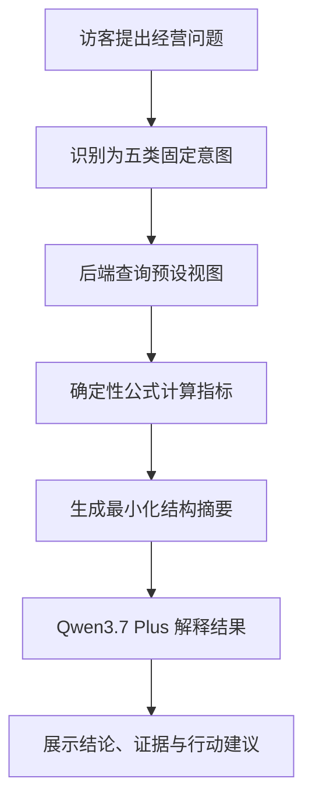
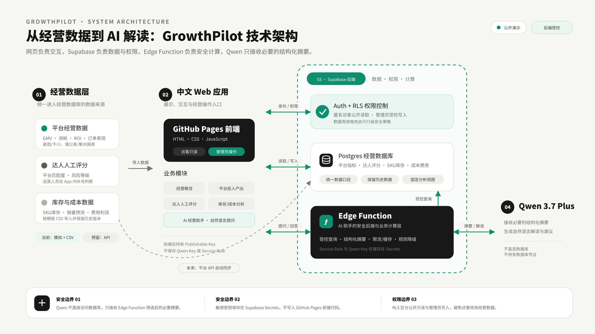

# GrowthPilot

> 面向日化品牌的 AI 经营分析工作台：统一复盘跨平台投放数据，并将达人判断、SKU 库存和成本利润放进同一套经营视图。

**在线体验：** [GrowthPilot Web App](https://perrrrrr.github.io/growthpilot-ai/)

公开演示使用模拟数据。访客可只读浏览并使用 AI 经营助手；管理员登录后可导入报表、维护达人评分和更新经营数据。

## 为什么做这个项目

日化品牌的投放与经营数据通常分散在星图、巨量千川、蒲公英、聚光等平台。不同报表的字段、统计口径和文件结构并不一致，达人是否适合品牌、是否存在履约风险等信息又很难完全通过平台指标反映。投放之后，销量变化还会继续影响 SKU 库存、补货和产品利润。

GrowthPilot 尝试解决三个连续问题：

1. 如何把不同平台的原始报表转换成可比较的统一指标；
2. 如何把客观经营数据与人工业务判断结合起来；
3. 如何让非数据岗位的使用者通过自然语言快速理解库存、达人、平台和利润风险。

## 核心功能

| 模块 | 解决的问题 | 主要输出 |
| --- | --- | --- |
| 投放数据导入 | 不同平台报表字段与结构不一致 | 字段自动匹配、标准化预览、异常校验、发布批次 |
| 平台投入产出 | 跨平台指标无法直接比较 | 总成本、净 GMV、净 ROI、订单、曝光、互动率 |
| 达人手动评分 | 平台数据无法覆盖品牌适配与履约风险 | 品牌/品类/人群/内容匹配度、风险等级与备注 |
| 库存管理 | 销量变化可能造成缺货或积压 | 四周销量预测、覆盖天数、周转率、补货建议 |
| 成本费用分析 | GMV 无法代表真实经营收益 | 毛利、贡献利润、贡献利润率、费用拆解 |
| AI 经营助手 | 经营数据对非专业使用者不够直观 | 数据证据、结论解释、行动建议与回答来源 |

## AI 经营助手如何工作

AI 助手不会直接访问数据库，也不会把自然语言转换成任意 SQL。



当前只允许五类受控问题：

- 库存风险
- 达人优先级
- 平台投入产出
- 成本与利润
- 经营概览

模型负责解释，不负责创造关键数字。每个回答都会展示数据来源与关键证据；模型不可用时，系统会明确标注“透明规则回退”。

## 关键指标口径

### 平台投入产出

- **总成本** = 达人合作费 + 投流费用 + 佣金费用
- **净 GMV** = 支付 GMV − 退款金额
- **净 ROI** = 净 GMV ÷ 总成本
- **互动率** = 互动量 ÷ 曝光量

平台报表只用于复盘，不承担平台内部实时投流决策。实时测试、出价和素材优化仍应在各平台广告系统内完成。

### 达人综合判断

客观数据与人工判断分开保存：

- 客观数据：曝光、互动、订单、费用、净 GMV、净 ROI；
- 人工判断：品牌调性、品类、人群、内容形式匹配度，以及履约与舆情风险；
- 最终建议：在经营表现满足要求的基础上，优先选择高匹配、低风险达人。

### 库存预测

- **预测周销量** = W4 × 10% + W3 × 20% + W2 × 30% + W1 × 40%
- **未来四周预测销量** = 预测周销量 × 4
- **库存覆盖天数** = 当前库存 ÷ 预测周销量 × 7
- **补货建议**同时考虑预测销量、采购提前期和安全库存
- 覆盖天数低于 28 天标记缺货风险，高于 56 天标记库存偏高

该方法是适合 MVP 的透明加权移动平均，而不是对真实供应链精度的夸大承诺。

### 成本与利润

- **毛利** = 营业收入 − 产品成本
- **营销费用** = 达人合作费 + 投流费用 + 佣金费用
- **运营费用** = 履约 + 仓储 + 退货 + 其他费用
- **贡献利润** = 营业收入 − 产品成本 − 营销费用 − 运营费用

## 数据导入设计

平台 API 暂未在公开演示版中实际授权。星图、巨量千川、蒲公英和聚光的正式 API 通常要求企业广告账户、开发者资质、接口审批及 OAuth 授权，因此项目没有用伪造的“已连接 API”替代真实接入。

当前采用可扩展的报表导入框架：


不同文件无需手工改成完全一致的列名。系统根据常见别名自动匹配字段，允许人工确认映射，并保留导入批次、原始字段和校验结果。未来取得正式授权后，可在同一标准化数据层前增加平台 API Adapter。

## 数据与模型安全

- Qwen API Key 仅保存在 Supabase Edge Function Secrets，浏览器和 GitHub 仓库均不可见；
- Edge Function 使用固定意图和固定查询，不接受任意 SQL；
- 只向模型发送回答当前问题所需的最小化结构摘要；
- 公开访客只读，导入、修改和删除仅限管理员；
- 不保存完整提问和回答，只记录哈希、意图、Token、耗时与运行状态；
- 设备、IP 和全站三级限流，并对重复问题使用短期缓存；
- 公开版仅包含模拟数据，真实企业数据应使用独立项目并要求身份认证。

## 技术架构

- **前端：** HTML、CSS、JavaScript，构建为可直接部署的单文件网页
- **数据库与认证：** Supabase Postgres、Row Level Security、Email/Password Auth
- **后端：** Supabase Edge Functions
- **大模型：** 阿里云百炼 Qwen3.7 Plus
- **部署：** GitHub Pages + Supabase
- **质量保障：** Node.js 自动化测试与静态安全检查

<h2>系统架构</h2>

<p>
  GrowthPilot 将网页交互、经营数据、权限控制和大模型分析分开处理，确保经营数据不会直接暴露给模型。
</p>

<p align="center">
  
</p>

## 项目结构

```text
GrowthPilot-GitHub-Pages/
├── index.html                         # GitHub Pages 单文件应用
├── frontend/                          # 前端源代码与构建入口
├── supabase/migrations/               # 数据表、视图、RLS 与 AI 运行表
├── supabase/functions/ai-assistant/   # AI Edge Function
├── tests/                             # 指标、权限、导入与 AI 安全测试
├── *_template.csv                     # 三类导入模板
└── DEPLOY-AI-ASSISTANT.md              # AI 助手部署说明
```

## 本地构建与检查

```bash
npm install
npm run build:frontend
npm test
npm run check
```

当前包含 17 项自动化测试，覆盖库存预测、平台导入、公开只读、管理员权限、AI 密钥隔离、受控意图、限流与透明回退。

## 我的工作

这是一个个人作品集项目。我独立完成了：

- 从日化品牌达人投放经历中识别业务痛点并定义 MVP；
- 跨平台指标口径、达人评分标准、库存预测和利润拆解设计；
- 数据库建模、RLS 权限、CSV 标准化导入与历史批次设计；
- 中文网页的信息架构、交互与公开部署；
- Qwen3.7 Plus 的受控接入、证据链、限流、缓存和规则降级；
- 功能测试、安全检查与非技术用户部署文档。

## 项目边界与下一步

当前版本重点验证“跨平台数据标准化 + 经营分析 + 受控 AI 解释”的完整链路，不将 MVP 包装成生产级企业系统。

后续可继续完善：

1. 获得企业账号授权后接入真实平台 API 与定时同步；
2. 引入更长时间序列、促销和季节性特征，提高销量预测精度；
3. 增加企业级 RBAC、审计日志和多租户数据隔离；
4. 建立 AI 回答评测集，持续评估准确性、可解释性和成本。

---

本项目用于展示我对产品需求、业务指标、数据建模与生成式 AI 落地的综合实践能力。
